# Text2SQL Generator with LLM

 [](https://opensource.org/licenses/Apache-2.0)


[English](https://github.com/kangZan/GenerateSQLWithLLM/blob/main/README_EN.md)
/
[中文](https://github.com/kangZan/GenerateSQLWithLLM/blob/main/README.md)

基于大语言模型的文本到SQL生成工具，支持自定义提示词、重试机制和数据库适配。通过自然语言问题自动生成符合规范的SQL语句。

## 🌟 核心功能

### 核心特性

- **自然语言转SQL**：输入业务问题直接生成可执行SQL
- **智能上下文构建**：自动解析表结构元数据生成提示词
- **多策略支持**：
  - 可配置的数据库方言（MySQL/Oracle/PostgreSQL等）
  - 可扩展的SQL解析策略
  - 自定义提示词模板
- **鲁棒性保障**：
  - 自动重试机制（默认3次）
  - 请求超时设置（默认30秒）
  - 输入参数校验

### 支持场景

- 基于企业结构化数据的用户提问数据索引（区别于RAG技术的索引）
- 由大模型根据用户问题及表结构生成需要查询数据的sql，执行sql后再将查询出的数据与用户问题一同提交给大模型，无需手动维护RAG索引及知识库

## 🚀 快速开始

### 基础用法

```java
	// 初始化连接api配置
  		LLMInfo llm = new LLMInfo();
        llm.setApiKey("Bearer your key");
        llm.setModel("qwen2.5:latest");//"deepseek-r1:1.5b";
        llm.setChatEndpoint("http://localhost:11434/v1/chat/completions");
		// 创建生成器（使用默认配置）
		GenerateSQLWithLLM generator = new GenerateSQLWithLLM(llm);
    
        try{
			// 生成sql
            String sql = generator.generateSQL("本月系统的登录人数和登录人次分别是多少？", testGetListTableMeta());
            System.out.println("--->" + sql);
        }catch (SqlGenerationException e){
            e.printStackTrace();
        }

```

### 在Config类中可配置的参数 

```
properties复制# 
maxRetries = 1          # 最大重试次数 
timeout = 5000         # 请求超时时间(ms)
dataBaseName = MySQL    # 目标数据库类型 
```

## 🔧 高级用法

### 自定义提示词

```java
String customPrompt = """
    你是一个资深的MySql DBA。根据以下表结构：
    xxx
    请将这个问题转换为SQL：
    your_question
    要求：使用WITH子句和窗口函数 
    """;
 
generator.generateSQL(question,  tables, customPrompt);
```

### SQL解析策略

实现`SQLParser`接口来扩展解析逻辑：

```java
public class CustomSQLParser implements SQLParser {
    @Override 
    public String extract(String rawResponse) {
        // 实现自定义解析逻辑 
        return rawResponse.replaceAll("```sql",  "");
    }
}
 
config.setSqlExtractor(new  CustomSQLParser());
```

## 🛠 异常处理

### 常见异常类型

| 异常类型                 | 触发场景                  | 处理建议                  |
| ------------------------ | ------------------------- | ------------------------- |
| SqlGenerationException   | 模型响应解析失败/网络错误 | 检查模型响应格式/网络连接 |
| IllegalArgumentException | 空问题参数/空表结构列表   | 添加参数校验              |
| HttpException            | API端点不可用/认证失败    | 检查API密钥和网络配置     |

### 重试机制流程图

```mermaid
graph TD 
    A[开始调用] --> B{成功?}
    B -->|是| C[返回SQL]
    B -->|否| D{重试次数 < 3?}
    D -->|是| E[等待1秒] --> B 
    D -->|否| F[抛出异常]
```



## 📚 类结构说明

### GenerateSQLWithLLM 核心类


## 📦 依赖项

- **核心库**：Hutool 6.1.0（HTTP/JSON处理）、com.theokanning.openai-gpt3-java（大模型调用）
- **运行时**：Java 17+

## 📜 版本历史

- `v1.0` (2025/03/05)：基础生成功能实现

## 🤝 贡献指南

欢迎通过Issue提交建议或PR参与开发。请确保：

1. 遵循Java代码规范
2. 新增功能需包含单元测试
3. 更新JavaDoc文档


