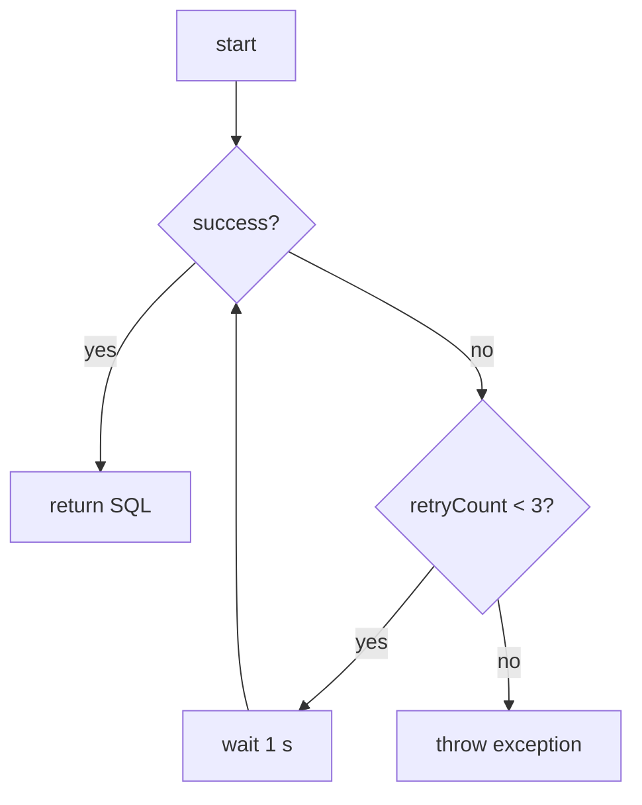
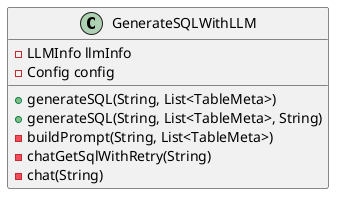

# Text2SQL Generator with LLM

 [](https://opensource.org/licenses/Apache-2.0)

A text-to-SQL generation tool based on a large language model, supporting customizable prompts, retry mechanisms, and database adaptation. Automatically generates standardized SQL statements through natural language questions.

## 🌟 Core Features

### Core Features

- **Natural Language to SQL**：Input business issues to generate executable SQL
- **Intelligent Context Construction**：: Automatically Parse Table Structure Metadata to Generate Prompt Words
- **Multi-strategy support**：
  - Configurable database dialect (MySQL/Oracle/PostgreSQL, etc.)
  - Scalable SQL Parsing Strategy
  - Custom prompt template
- **Robustness guarantee:**：
  - Automatic retry mechanism (default 3 times)
  - Request Timeout Setting (default 30 seconds)
  - Input parameter validation

### Support scenarios

- User question data index based on enterprise structured data (different from the index of RAG technology)
- Generated SQL based on user questions and table structure by large model, submit the queried data along with the user question to the large model after executing the SQL, no need to manually maintain RAG index and knowledge base

## 🚀 Get Started Quickly

### Basic Usage

```java
		// init llm info config
  		LLMInfo llm = new LLMInfo();
        llm.setApiKey("Bearer your key");
        llm.setModel("qwen2.5:latest");//"deepseek-r1:1.5b";
        llm.setChatEndpoint("http://localhost:11434/v1/chat/completions");
		// create GenerateSQLWithLLM use default config
		GenerateSQLWithLLM generator = new GenerateSQLWithLLM(llm);
    
        try{
            String sql = g.generateSQL("We need to calculate this month's login count.", testGetListTableMeta());
            System.out.println("--->" + sql);
        }catch (SqlGenerationException e){
            e.printStackTrace();
        }

		// generat sql
		 String sql = generator.generateSQL("？",tables);


```

### In the Config class, configurable parameters

```properties 
maxRetries = 1         
timeout = 5000         
dataBaseName = MySQL    
```

## 🔧 Advanced Usage

### Custom prompt

```java
String customPrompt = """
    You are a senior MySQL DBA. Based on the following table structure:
		xxx
	Please convert this question into SQL:
		your_question
	Requirements: Use the WITH clause and window functions.
    """;
 
generator.generateSQL(question,  tables, customPrompt);
```

### SQL parsing strategy

Implement the `SQLParser` interface to extend the parsing logic:

```java
public class CustomSQLParser implements SQLParser {
    @Override 
    public String extract(String rawResponse) {
        // Custom SQLParser logic
        return rawResponse.replaceAll("```sql",  "");
    }
}
 
config.setSqlExtractor(new  CustomSQLParser());
```

## 🛠 Exception 

### Common exception types

| Exception type           | Trigger scenario                                     | Process suggestions                            |
| ------------------------ | ---------------------------------------------------- | ---------------------------------------------- |
| SqlGenerationException   | Model response parsing failed/network error          | Check model response format/network connection |
| IllegalArgumentException | Empty question parameters/Empty table structure list | Add parameter validation                       |
| HttpException            | API endpoint unavailable/authentication failed       | Check API key and network configuration        |

### Retry mechanism flowchart



## 📚 Book structure description

### GenerateSQLWithLLM core class



## 📦 Package dependencies

- **核心库****Core library:** Hutool 6.1.0 (HTTP/JSON processing), com.theokanning.openai-gpt3-java (large model invocation)
- **Runtime**：Java 17+

## 📜 Version History

- `v1.0` (2025/03/05)：Basic generation function implemented

## 🤝 Contribution Guide

Welcome to submit suggestions or PRs to participate in development. Please ensure:

1. Follow Java code conventions
2. New features must include unit tests
3. Update JavaDoc documentation


